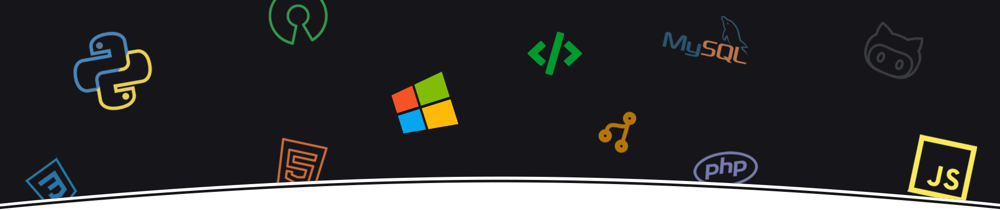
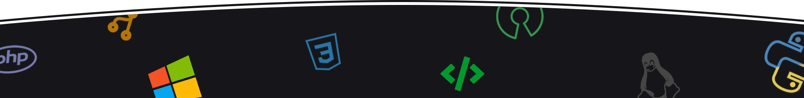

<!--

-->

<h2 align="left">
  Hi, Human!
</h2>

  <em>
    Eu sou o Carlos, um jovem apaixonado por aprender coisas novas, tecnologia, programação e algoritmos! atualmente eu sou um estudante no Instituto Federal do Piauí.
  </em>

  
Mais sobre mim

  <ul>
    <li>🎓 Técnico em Informática pelo IFPI</li>
    <li>📚 Estudando Dev. Web e Mobile | Algoritmos | Matemática | Inglês</li>
  </ul>

  
Minhas Estátisticas no Github

  

    
    
  

  Quer uma ajuda em projetos open-source, me contratar ou apenas bater um papo? Entre em contato comigo!

  
  
  
  
  

<!--

-->
